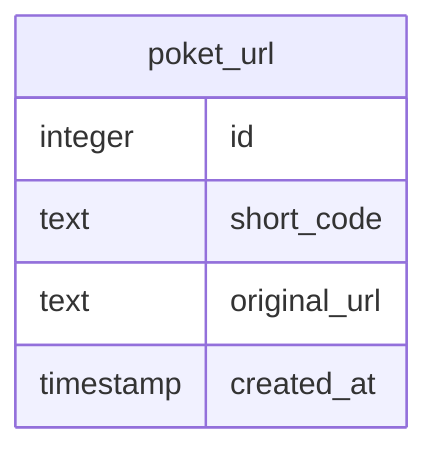
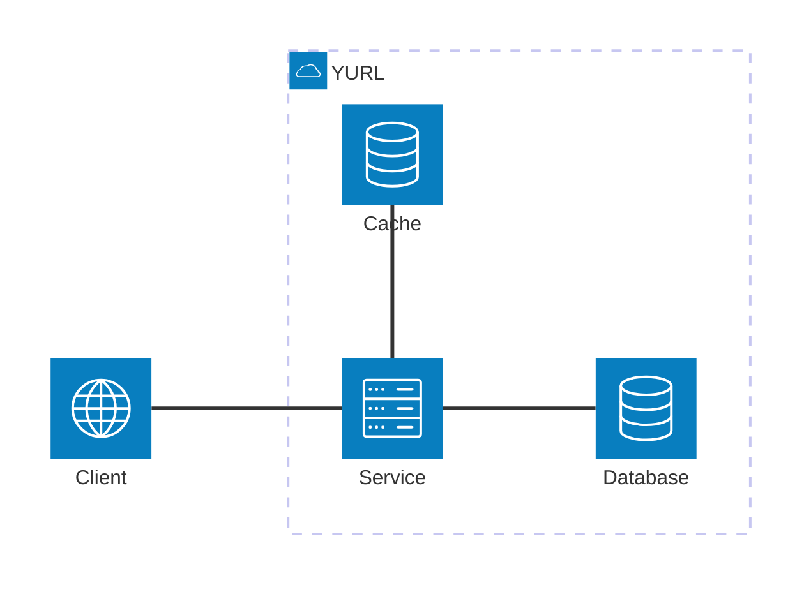
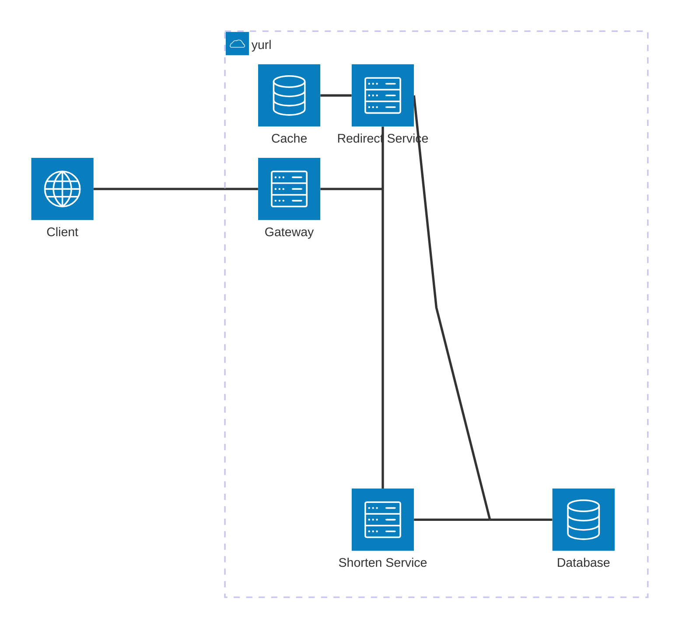

# PoketUrl

A URL shortening service built with Ktor.

## Getting Started

### Installation

1. Clone the repository:
   ```bash
   git clone <repository-url>
   cd poketurl
   ```

2. Build the project:
   ```bash
   ./gradlew build
   ```

### Running the Application

Start the server:
```bash
./gradlew run
```

The server will start on port 5000 (configurable in `src/main/resources/application.yaml`).
```
2024-12-04 14:32:45.584 [main] INFO  Application - Application started in 0.303 seconds.
2024-12-04 14:32:45.682 [main] INFO  Application - Responding at http://0.0.0.0:5000
```

### Configuration

The application can be configured via environment variables or the `application.yaml` file:

- `DB_URL`: Database connection string (default: `jdbc:sqlite:./app/data/poketurl-db.sqlite`)
- Server port can be changed in `application.yaml` under `ktor.deployment.port`

## Design

### API Design

```yaml
openapi: 3.0.0
info:
  title: PoketUrl API
  version: 1.0.0
servers:
  - url: http://0.0.0.0:5000
paths:
  /shorten:
    post:
      tags:
        - shortener
      summary: Create a shortened URL
      requestBody:
        required: true
        content:
          application/json:
            schema:
              $ref: '#/components/schemas/ShortenRequest'
      responses:
        '200':
          description: Shortened code
          content:
            text/plain:
              schema:
                $ref: '#/components/schemas/ShortenResponse'
        '400':
          $ref: '#/components/responses/BadRequest'
        '409':
          $ref: '#/components/responses/Conflict'
        '500':
          $ref: '#/components/responses/InternalError'
  /r/{code}:
    get:
      tags:
        - shortener
      summary: Resolve a short code and redirect
      parameters:
        - name: code
          in: path
          required: true
          schema:
            type: string
      responses:
        '302':
          description: Redirect to original URL
          headers:
            Location:
              description: Destination URL
              schema:
                type: string
                format: uri
        '400':
          $ref: '#/components/responses/BadRequest'
        '404':
          $ref: '#/components/responses/NotFound'
        '500':
          $ref: '#/components/responses/InternalError'
components:
  schemas:
    ShortenRequest:
      type: object
      required:
        - url
      properties:
        url:
          type: string
          format: uri
    ShortenResponse:
      type: object
      required:
        - url
        - key
        - fullUrl
      properties:
        key:
          type: string
        url:
          type: string
          format: uri
        fullUrl:
          type: string
          format: uri
    ErrorResponse:
      type: string
  responses:
    BadRequest:
      description: Bad request
      content:
        text/plain:
          schema:
            $ref: '#/components/schemas/ErrorResponse'
    Conflict:
      description: Code collision
      content:
        text/plain:
          schema:
            $ref: '#/components/schemas/ErrorResponse'
    NotFound:
      description: Resource not found
      content:
        text/plain:
          schema:
            $ref: '#/components/schemas/ErrorResponse'
    InternalError:
      description: Unexpected error
      content:
        text/plain:
          schema:
            $ref: '#/components/schemas/ErrorResponse'
```

### Database Schema

For the database schema, it is a simple design for the initial set of requirements.
A single lookup table is enough to store this information.



An index is created for `short_code` to increase lookup speeds.

**Capacity Planning**

| Column                          | Storage                                                          |
| ------------------------------|--------------------------------------------------------------------- |
| `id`               | 8 bytes                                        |
| `short_code`             | 9 bytes                                  |
| `original_url`            | 200 bytes average, 8192 bytes worst-case |
| `created_at`          | 19 bytes                      |
| overhead          | 8 bytes                      |

Average: 244 bytes (row) * 1b records -> 244GB

Worst case: 8236 bytes (row) * 1b records -> 8.2TB

This does not include indexes.

### System Design

Characteristics:
* Original Url supports 8192 lenght as per [RFC Spec](https://www.rfc-editor.org/info/rfc9110/#section-4.1-5)
* Alphabet has 62 characters (base62)
* A key is 8 characters, gives pool of 213 trillion mappings.
* High-read, low-write service -> should be optimized for reading.

#### Key creation strategies

* Use an incrementing counter and base62 encoding
  * This assumes the base62 alphabet is used for keys.
  * Each key creation the counter is incremented and that value is encoded with base62 resulting in the key.
  * Offers predictability.
  * If the service holds this counter in-memory, increasing the number of instances will create issues and collisions
  since each instance will start with a new counter (assuming it starts from 0).
  * To solve this Redis (or any other in-memory single threaded cache) can be used.
* (**Our pick**) Use a randomly generated string
    * Define an alphabet and use seeds or secure-random algorithms to generate keys.
    * Instances are stateless.
    * Small chances of collisions can be handled with retries.
* Hash input URL and slice length of the key
  * A hashing algorithm (md5, sha256) is applied once/twice to a URL and the first/last X characters are chosen
  * Offers predictability.
  * Instances are stateless
  * Collision handling is more complex since you have to keep track of how many times the URL was hashed

### Design Graphs



* The overall design is straightforward and has a low cognitive load.
* To optimize for high-read, an in-memory cache is used. 
* Low fault tolerance, if the service is down, everything is unavailable.

---



* Separates creation and redirection into separate services to increase fault tolerance.
  * If creation is not working, redirection+analytics still works
* Still has the same benefits of the design above
* Increases cognitive load and deployment complexity

## Architecture

PoketUrl tries to follow clean architecture principles.

- **Domain**: Business entities and rules (PoketUrl, ShortCode, OriginalUrl)
- **Application**: Use cases and application interfaces (ports)
- **Infrastructure**: Implementation details (database, web framework, caching)

## Testing

Run the test suite:
```bash
./gradlew test
```

## License

This project is licensed under the MIT License.
```
Copyright 2026 Nikola Drljaca

Permission is hereby granted, free of charge, to any person obtaining a copy of this software and associated documentation files (the “Software”), to deal in the Software without restriction, including without limitation the rights to use, copy, modify, merge, publish, distribute, sublicense, and/or sell copies of the Software, and to permit persons to whom the Software is furnished to do so, subject to the following conditions:

The above copyright notice and this permission notice shall be included in all copies or substantial portions of the Software.

THE SOFTWARE IS PROVIDED “AS IS”, WITHOUT WARRANTY OF ANY KIND, EXPRESS OR IMPLIED, INCLUDING BUT NOT LIMITED TO THE WARRANTIES OF MERCHANTABILITY, FITNESS FOR A PARTICULAR PURPOSE AND NONINFRINGEMENT. IN NO EVENT SHALL THE AUTHORS OR COPYRIGHT HOLDERS BE LIABLE FOR ANY CLAIM, DAMAGES OR OTHER LIABILITY, WHETHER IN AN ACTION OF CONTRACT, TORT OR OTHERWISE, ARISING FROM, OUT OF OR IN CONNECTION WITH THE SOFTWARE OR THE USE OR OTHER DEALINGS IN THE SOFTWARE.
```

